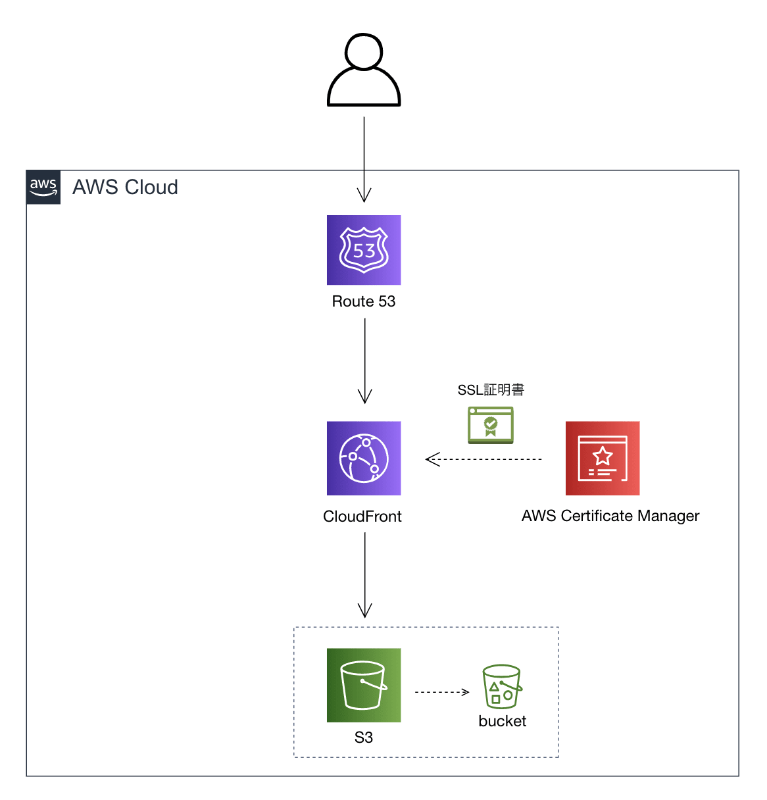

# 基本設計書

## システム構成

物理サーバは用意せず、AWSのクラウドサービスを使用する。

* クライアント（SPAを想定）
 

参考 [【AWS】S3+CloudFront+Route53+ACMでSSL化(https)した静的Webサイトを公開する](https://zenn.dev/wakkunn/articles/66a6e8372611dc)


* バックエンド
```plantuml
actor User

cloud AWS {
  node Internet_Gateway
  node ACM
  node Route53

  frame Public.subnet {
    node ALB
  }
  frame Private.subnet {
    frame Fargate {
      frame backend_service {
        node Task
      }
    }
    node RDS
    node ElastiCache
  }
  node SES
}

User --> Route53
Route53 --> Internet_Gateway
Internet_Gateway --> ALB
ALB --> Task
Task --> RDS
Task --> SES
Task --> ElastiCache

```

## NW構成

* アクセスポイント一覧

| サーバ端点                   | ドメイン         | IPアドレス | ポート        | 外部公開 | 備考  |
| ----------------------- | ------------ | ------ | ---------- | ---- | --- |
| クライアント:Route53          | studieee.com | 未定     | 443        | 〇    |     |
| バックエンド:Route53          | デフォルト        | 未定     | 443        | 〇    |     |
| バックエンド:Internet_Gateway | デフォルト        | 未定     | 443        | 〇    |     |
| バックエンド:ALB              | デフォルト        | 未定     | 443        | 〇    |     |
| バックエンド:Task             | デフォルト        | 未定     | 8080 or 80 | ×    |     |
| バックエンド:RDS              | デフォルト        | 未定     | 5432       | ×    |     |
| バックエンド:ElastiCache      | デフォルト        | 未定     | 6379       | ×    |     |
| バックエンド:SES              | デフォルト        | 未定     | 465 or 2645  | ×    |     |


## ユースケース

* 使い方・利用規約の確認
  * studieeeにアクセスするとどのように使うかと利用規約が確認出来る。
* アカウント登録
  * studieeeにアクセスしアカウント登録出来る。
  * アカウント登録時に確認メールがユーザーの元に届き承認を押すと本登録が完了する。
  * 認証後Zoom API Keyの発行をする。
* ログイン
  * studieeeにアクセスしログイン出来る。
  * ログインの手段は２つあり、studieeeの認証を使う場合とGoogleのOAuthを使う。
* プロフィール編集
  * ユーザーは自分のパスワードを変更出来る。
  * パスワードを忘れた場合はユーザーのメールアドレスに通知し、再度登録出来る。
* タスク計画
  * タスクを計画し運営にお金を払える。
  * タスクの計画と同時にZoomの会議のURLを発行され、Googleカレンダーに登録出来る。
* タスク通知
  * ユーザーはタスクの開始時間を通知する設定が出来る。
  * 何分に通知するかは自分で選ぶことが出来る。
* タスク完了
  * タスク完了後にお金を返金するかどうかを選べる。
* タスク実行履歴
  * 累計のタスク実行履歴を行った履歴を確認出来る。
* Zoom APIの発行手順確認
  * ユーザーはZoomのAPI発行手順を確認出来る。

## 機能一覧

* アカウント登録機能
  * ニックネーム、メールアドレス、パスワードを入力し、アカウントを登録する。
  * アカウント登録処理を実行した際は、studieee側からユーザーにメールを送信し本人であるかを認証する。
  * パスワードは2回入力し、誤ったパスワードが入力されないようにする。
  * 認証は24時間以内とする。認証されずに24時間経過した場合、DBに保存されているデータは削除する。
  * 認証後にZoom API Keyを登録する（ユーザーが自分で発行したものをプロフィール画面で登録）。
    * このZoom API Keyの有効期限が短い可能性有り。Selenium等で設定を自動化するか？ ★TODO
* ログイン機能
  * ログイン時にサーバーからJWTとリフレッシュトークンを払い出しクライアント側で持ちまわす。
  * JWTの有効期限は30分とし、リフレッシュトークンは1か月とする。
  * 複数の端末からはログイン出来ないようにする。後からログインしたユーザーを常に優先し、前にログインしていた端末からはログアウトされる。
  * ログイン試行回数は5回。5回を超えたら30分ログイン出来なくなる。
* プロフィール編集機能
  * ログイン中にニックネーム、パスワードを変更する。
  * パスワードを忘れた場合は、メール経由で再設定する。
    * パスワードの再設定は24時間以内とする。パスワード再設定がされずに24時間経過した場合、DBに保存されているデータは削除する。
* タスク計画機能
  * ユーザーがタイトルと日付、タスク内容を記載後、タスク実施の決意表明として運営にお金を支払う。
  * 複数のタスクを計画出来る。
  * タスク登録時にリピート登録出来る。例）1週間 毎日9時にランニングを行う。
  * 計画しているタスクを確認出来る。
  * 計画時にZoomの会議が設定される。
* タスク通知機能
  * ユーザーが計画したタスク通知をする。
  * 通知の頻度、通知の方式、通知する時間についてはユーザーが選択出来る。
* タスク開始・完了機能
  * Zoomの参加を検知しサーバ側でデータを保持する。
  * Zoomの終了を検知しサーバ側とのデータを判断しタスクをこなしたかを判断する。
* タスク実行履歴確認機能
  * 今まで実行したタスクを確認することが出来る。
  * 棒グラフ等で視覚的に見れる。

## ソフトウェア構成

```plantuml
actor User

node React_JavaScript

frame backend {
  node SpringBoot_Java
}

frame DB {
  node Redis
  node PostgreSQL
}

User --> React_JavaScript
User --> SpringBoot_Java
SpringBoot_Java --> PostgreSQL
SpringBoot_Java --> Redis
```

商用環境はS3を静的ホスティングしてJSファイルを配置、backendはAWSのFargate上にTaskとして構築する。

| FW/ライブラリ/言語 | バージョン  |
| ----------- | ------ |
| React       | 18.1.0 |
| JavaScript  | ES2022 |
| SpringBoot  | 2.6.7  |
| Java        | 17     |
| PostgreSQL  | 14.2   |
| Redis       | 6.2.6  |

2022/04/29 時点での最新または安定バージョンを選定

## エラー方針
* クライアントサイド、サーバサイド両方で入力値チェックをする。
* エラーメッセージは、クライアントサイド、サーバサイド両方で持つ。クライアントで完結するエラーの場合は、クライアントサイドで持っているエラーメッセージを表示し、サーバからエラーのレスポンスが返却された場合は、その情報を表示する。

## セキュリティ方針
* クライアントからの入力値をそのままサーバ側でSQL発行に使わない（SQLインジェクション対策）。
```
例）
   NG：
    Query query = em.createQuery("SELECT b FROM Book b WHERE b.title = '" + param + "'");
    List<Book> books = query.getResultList();
    return books.size();

   OK：
    Query query = em.createQuery("SELECT b FROM Book b WHERE b.title = :param");
    query.setParameter("param", param);
    List<Book> books = query.getResultList();
    return books.size();

paramは必ずプレースホルダー（:param）にバインド（割り当てる）する。
```

* 認証については、JWTとリフレッシュトークンの実装を行う。

[SPAのログイン認証のベストプラクティスがわからなかったのでわりと網羅的に研究してみた〜JWT or Session どっち？〜](https://qiita.com/Hiro-mi/items/18e00060a0f8654f49d6)
